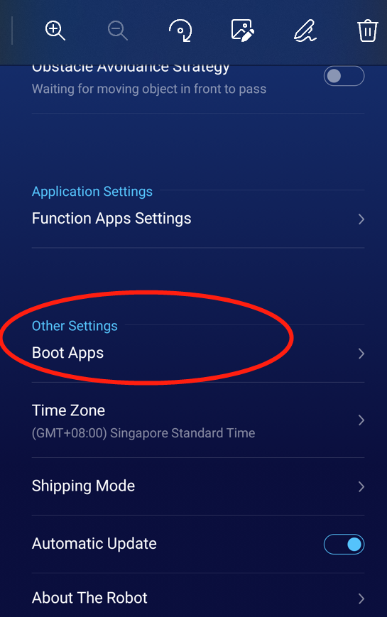

## Find the right version SDK
Different robot need different sdk lib, here is the sdk lib list. Check your robot and use the right one. Notice: even the Demo Code, you have to make sure the sdk lib right.

GreetBot SDK: [Download](https://orion-base-test-1256573505.cos.ap-beijing.myqcloud.com/cn_docs_file/2021-12-20_16%3A40%3A58_robotservice.zip)

Mini SDK: [Download](https://orion-base-test-1256573505.cos.ap-beijing.myqcloud.com/cn_docs_file/2021-12-16_15%3A53%3A10_robotservice.zip)

Lucki SDK: [Download](https://orion-base-test-1256573505.cos.ap-beijing.myqcloud.com/cn_docs_file/2021-12-20_16%3A43%3A13_robotservice_lucki.zip)

BigScreenBot SDK: [Download](https://orion-base-test-1256573505.cos.ap-beijing.myqcloud.com/cn_docs_file/2021-12-20_16%3A40%3A58_robotservice.zip)

Download the SDK lib, put it into app/libs folder (or replace sample code lib)

Robot APP Sample Code: [Download](https://orion-base-test-1256573505.cos.ap-beijing.myqcloud.com/cn_docs_file/2021-12-16_15%3A59%3A22_RobotSample-english.zip)


## Configure the default launcher
Configure Manifest file

```xml
<activity android:name=".MainActivity">
    <intent-filter>
        <action android:name="android.intent.action.MAIN"/>
        <category android:name="android.intent.category.LAUNCHER"/>
    </intent-filter>
    <intent-filter>
        <action android:name="action.orionstar.default.app" />
        <category android:name="android.intent.category.DEFAULT" />
    </intent-filter>
</activity>
```

If the App needs to be launched by default after booting, it needs to be configured in the Manifest.

```xml
<intent-filter>
    <action android:name="action.orionstar.default.app" />
    <category android:name="android.intent.category.DEFAULT" />
</intent-filter>
```
 
And set in the settings (three-finger pull down and click on the settings to enter)-Boot Apps


 
## Authority
For complete SDK access, the following permissions need to be declared in AndroidManifest.xml
```xml
<uses-permission android:name="android.permission.INTERNET"/>
<uses-permission android:name="android.permission.WRITE_EXTERNAL_STORAGE"/>
<uses-permission android:name="android.permission.READ_EXTERNAL_STORAGE"/>
```


## SDK access
1. Create a callback for receiving voice requests and system events

``` java
public class ModuleCallback extends ModuleCallbackApi {
    @Override
    public boolean onSendRequest(int reqId, String reqType, String reqText, String reqParam)
    throws RemoteException {
        //receive voice command,
        //reqTyp : voice command type
        //reqText : voice to text
        //reqParam : voice command parameter
        return true;
    }
    @Override
    public void onRecovery()
    throws RemoteException {
        //When receiving the event, regain control of the robot
    }
    @Override
    public void onSuspend()
    throws RemoteException {
        //Control is deprived by the system. When receiving this event, all Api calls are invalid
    }
}
```

2. Connect to the server

``` Java 
RobotApi.getInstance().connectServer(this, new ApiListener() {
    @Override
    public void handleApiDisabled() {}
    @Override
    public void handleApiConnected() {
        // Server is connected, set the callback for receiving requests, including voice commands, system events, etc.
        RobotApi.getInstance().setCallback(new ModuleCallback());
    }
    @Override
    public void handleApiDisconnected() {
        //Disconnect
    }
});
```
*Note: All APIs can only be called after successfully connecting to the server*

3. Set callback

``` Java 
RobotApi.getInstance().setCallback(new ModuleCallback());
```

4. End instruction

``` Java 
RobotApi.getInstance().finishModuleParser(reqId, result);
```

When the received request or voice command is processed, finishModuleParser needs to be called to end the command, reqId is obtained in the onSendRequest callback, and result is the execution result

5. Registration status monitoring

``` Java 
StatusListener statusListener = new StatusListener() {
    @Override
    public void onStatusUpdate(String type, String data) throws RemoteException {};
}

RobotApi.getInstance().registerStatusListener(type, statusListener);
RobotApi.getInstance().unregisterStatusListener(statusListener);
```

'type' is the type of state that needs to be monitored, and type supports the following:

- Definition.STATUS_POSE: The current coordinates of the robot, continuously reported
- Definition.STATUS_POSE_ESTIMAT: current positioning status, reported when the positioning status changes

6. Set reqId

Many SDK methods need to pass in the parameter reqId, which is an id used for debugging and tracking logs. 
Passing in any number can make the function work normally, but for the convenience of log tracking and debugging, 
it is recommended to make reqid an self-increasing static variable, or pass in different reqId to distinguish the calling function according to business needs.
