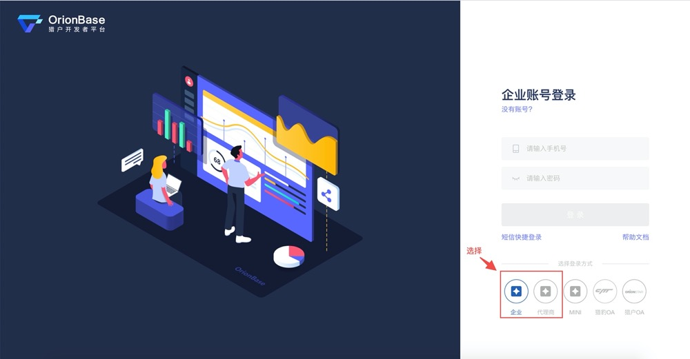
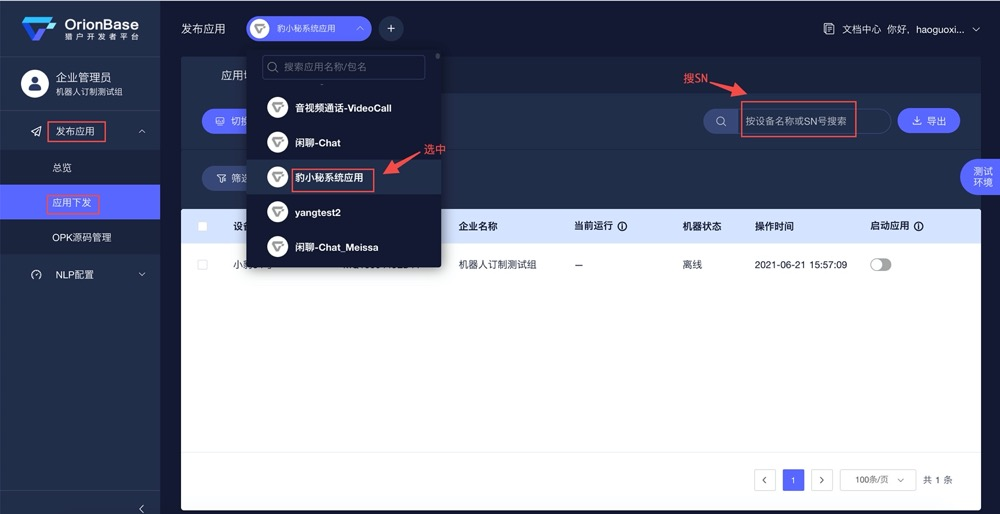
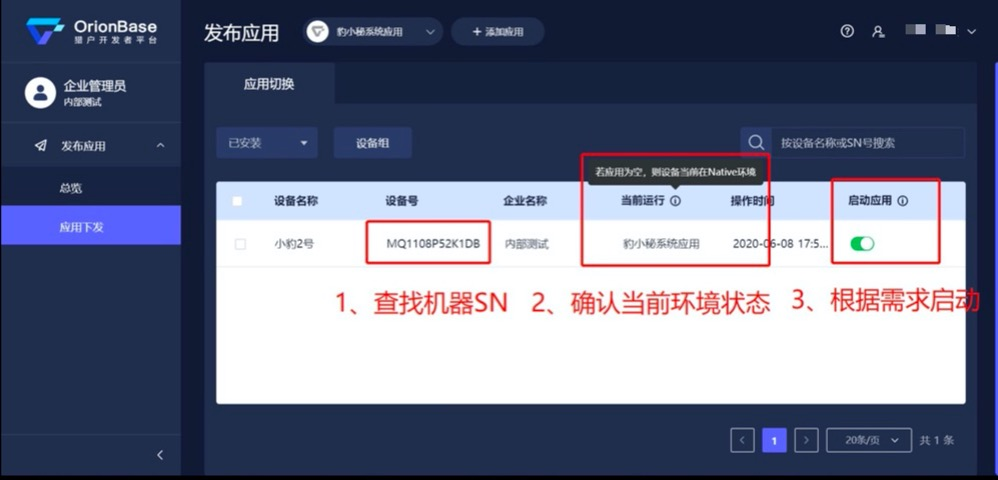
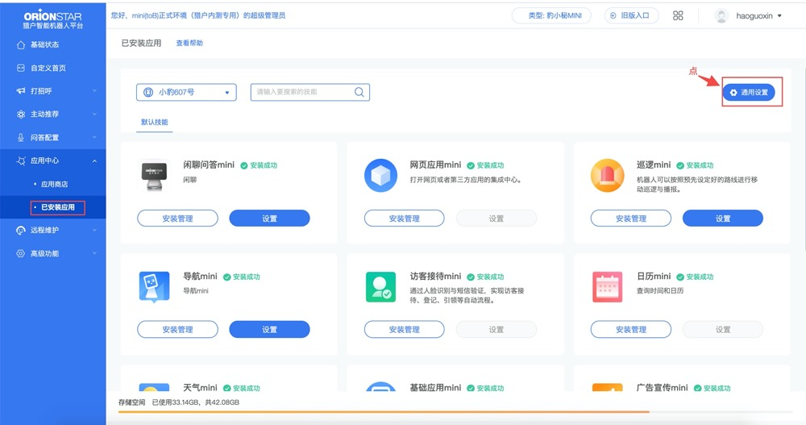

## OPK/APK development environment switch

### Login to the orionbase platform 
https://console.orionbase.cn

Account (Reception backstage/EO backstage): Super administrator phone number and password



### Publish the application->Application release




Note:

1.After turning on the switch, wait for 3-5 minutes to see if it starts successfully;

2.If the switch is overtime, you can try to restart the robot and then try to switch to start;

### Non-replacement system OPK is ignored, and the following steps are ignored:

If you need to switch the OPK of the second opening, please switch to the RN environment, select the OPK application of the second opening in the reception background (https://jiedai.ainirobot.com/), publish the application -> switch and start.




## How to get machine logs

Use adb command to fetch files from the robot. It will be used when we want to fetch the machine log.

### Get all the logs of the robot：

```
adb pull /sdcard/logs/offlineLogs/821/
```

### Get the log of the robot at the specified time.

1. Use this command to view all saved logs on the robot. And order them by time

```
adb shell

cd /sdcard/logs/offlineLogs/821/

ls -l
```

2. Then use adb pull to take out the logs that require a period of time. The logs time is before the file name time.

```
adb pull /sdcard/logs/offlineLogs/821/logcat.log-2020-05-22-11-00-07-062
```