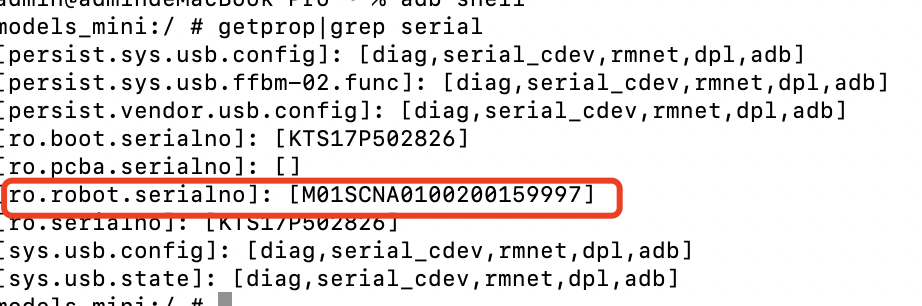
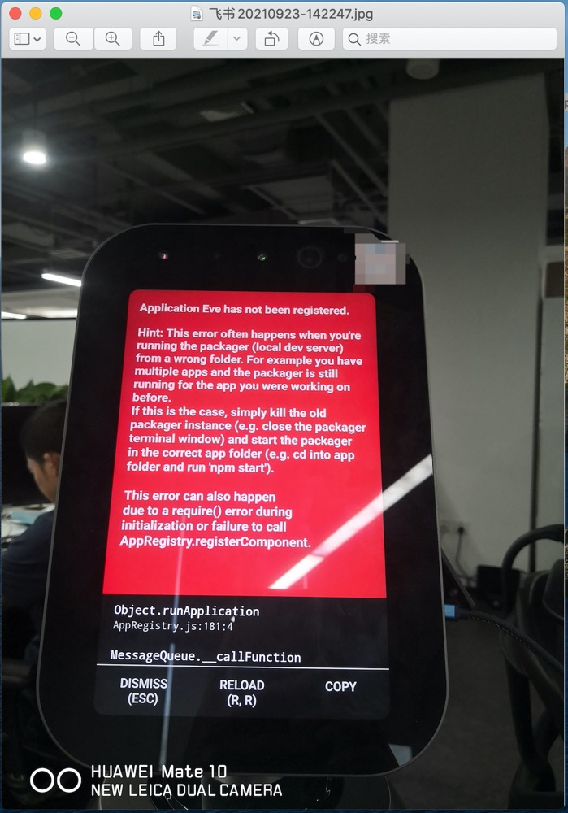
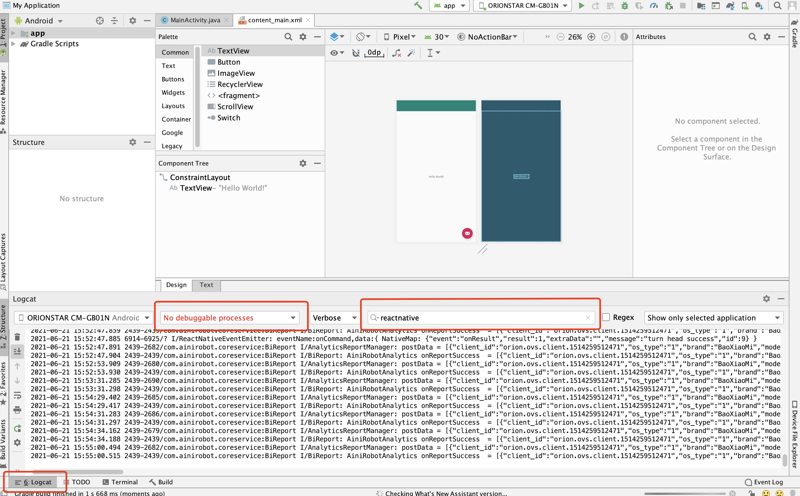
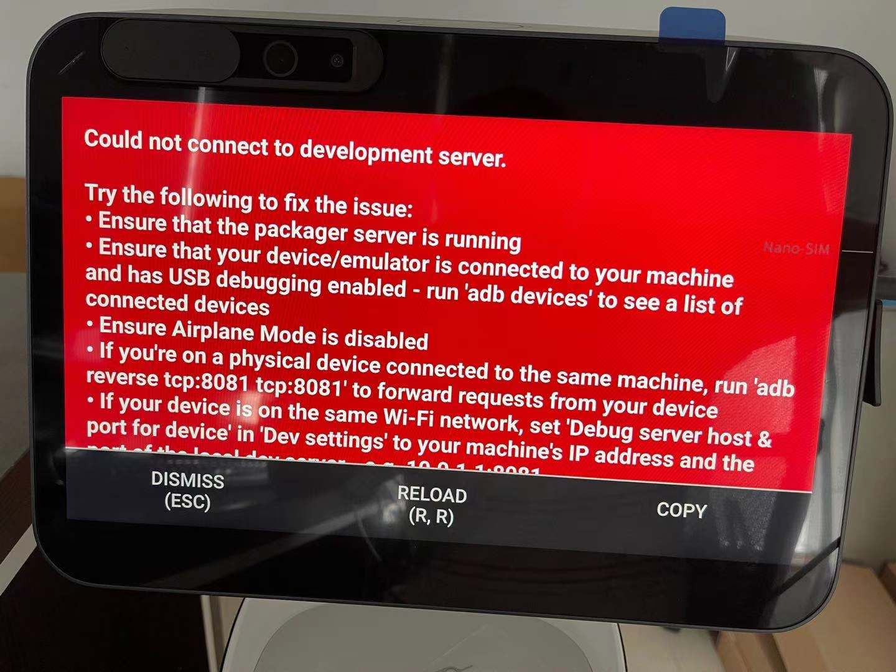
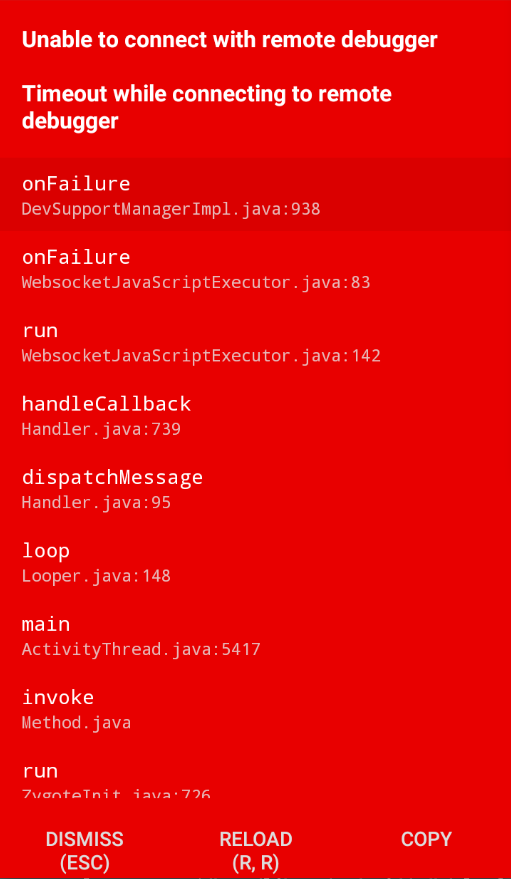
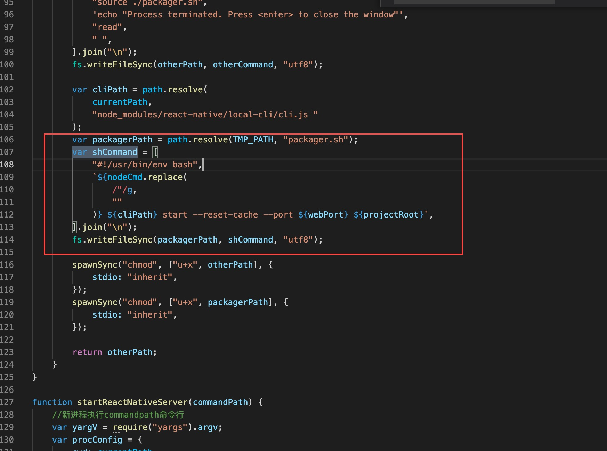
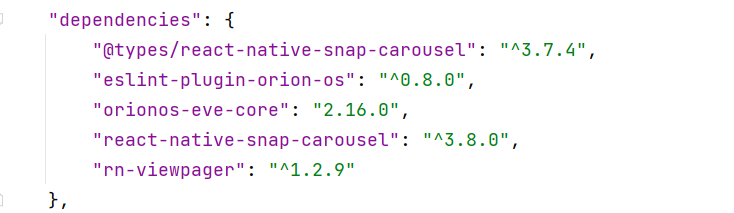
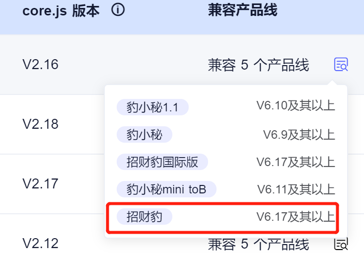
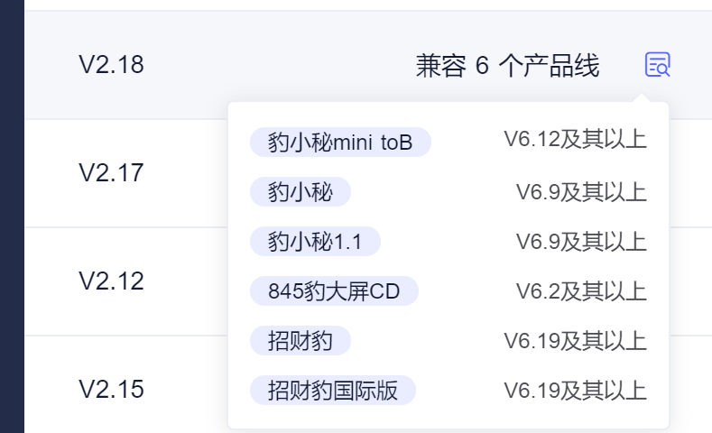
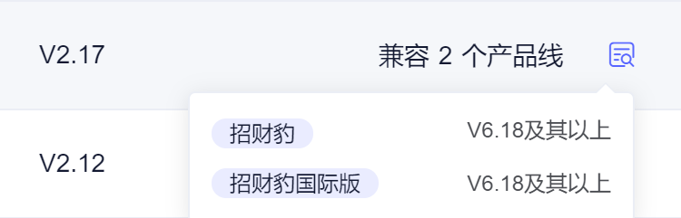

## How to start the sample code

### Start method:

The command line switches the current project directory: orionos-sh run

Three-finger slide->Application Center->Little Leopard

Voice Command Little Leopard Little Leopard "Open the developer's demo example"

## OPK does not take effect

### Possible situations where OPK does not take effect

1. Wrong OPK causes big eyes to flicker, and subsequent OPKs will also be unusable

2. The configured domain and intent did not take effect, causing OPK to fail to start

3. If jdk is not installed, OPK may not be installed successfully after run

4. The system version is still using the old version such as 5.2, causing most of the OPK functions to be unavailable,
   and the latest version that needs to be upgraded

After the voice is configured on the NLP platform, the voice tool on the robot can be used to test whether the
configured voice is compounded.

You can open the voice tool here:

### Three-finger pull-down -> Application Center -> Voice Tools.

For example: after we configure the startup domain and intent of the new OPK, we want to verify whether the voice can
trigger the domain and intent correctly, we only need to open the voice tool and say the corresponding words to the
robot to see the key logs, for example We want to test that "open the developer's demo" to the robot, and see if the
robot can get the correct Domain and intent. You can get the following answer:

   <video width="270" height="480" controls>
            <source src="/assets/docs/kyma/master/faq/docs/assets/voice.mp4" type="video/mp4">
   </video>


demonstrate_app&open,It is the answer we configured, and the test is complete.

## Commonly used adb commands

Whether using opk or apk, robot development is based on Android, so first of all, we must ensure that there is no
problem with the Android environment. The more important thing in the Android environment is the use of adb commands.
Here are some commonly used adb commands:

### 1、adb devices

This command is used to query the currently connected device number. When the computer is connected to the robot
normally, it will return to the robot list, as shown in the figure below:

```java
black_mac:dexlib mac$ adb devices
List of devices attached
KTS17Q080284    device
```

If the list of connected robots is not returned, debugging is not possible. First of all, please check whether the USB
cable is connected to the robot and is secure. If you encounter other problems, please search for adb devices on Baidu
and fail to return the correct results.

### 2、adb shell

This command is used to enter the terminal shell of the robot. Here are a few commonly used adb shell commands:

View machine sn code: adb shell getprop|grep serial



Clear module app data: adb shell pm clear com.ainirobot.moduleapp

### 3、adb push

This command is used to push files to the robot. It will be used when manually upgrading the robot. We need to push the
upgrade package to the corresponding folder of the robot.

adb push xxx.opk/system/vendor/opk/

Manual ota upgrade machine

After the adb command is normally opened and the machine is connected, execute the following command:

adb shell am start -n com.ainirobot.ota/.MainActivity //Open ota service;

adb push xxxx /sdcard/ota/download/update.zip //Push in the ota package, where xxx is the file path where the ota
package is located;

After the package push is completed, click "Start Upgrade" on the robot page.

### 4、adb pull

This command is used to fetch files from the robot. It will be used when we want to fetch the machine log.

Get the latest log of the robot：

adb pull /sdcard/logs/offlineLogs/821/

Get the log of the robot at the specified time.

1. Use this command to view all saved logs on the robot.

adb ls /sdcard/logs/offlineLogs/821/

2.Then use adb pull to take out the logs that require a period of time.

adb pull /sdcard/logs/offlineLogs/821/logcat.log-2020-05-22-11-00-07-062

### 5、 adb install

This command is used to install the application to the machine, usually used to install the developed apk package.

install apk: adb install -r -d xx.apk //xx.apk is the absolute path where your file is located.

For more adb commands, please search on Baidu by yourself.

## Trigger considerations

Trigger can realize the jump between opk and opk. The development process of calling carefully refers to the development
process of sample code. Below are some common problems that cannot be used correctly.

### 1. Debug mode and inability to use trigger

The trigger scheduling is realized by the robot's workflow. When debugging in the debug mode, the robot's operating
environment is borrowed to run the local code on the computer. At this time, there is no robot's workflow function, so
the trigger cannot be used in the debug mode, otherwise it may be possible When a red screen appears:



### 2. The page you jump to must be registered

When the trigger is called, the page (appKey) that jumps to must be registered in the index.js of the project, or use
the built-in appKey of the robot. The unregistered appKey cannot use the jump normally.

The registration method of the page is as follows, in the index.js of the project, appKey is the name of the page.

```java
AppRegistry.registerConfig([{
    appKey: 'portal',
    component: () => App,
    appId: appid,
    priority: 1
}]);
```

## Android real-time log

Commonly used adb commands can be used to obtain machine-side logs. For specific commands, please refer to common adb
commands. Since the log generation takes time, if you need to view the log in real time, you can use the Logcat module
of the Android studio software. The use steps are as follows:

### 1. Download and configuration of Android studio

Software installation and configuration can be done by Baidu:[Installation of Android Studio](https://developer.android.google.cn/studio/)

### 2. View logs through android studio

First, you need to open an android project through android studio, if not, you can create a new android project.

After opening, you can view the real-time log in the Logcat module of the main interface. You can filter the log by
package name, keywords, etc. For other detailed operations, please refer to the specific use of android studio logcat on
Baidu.



## Do not update after opk is installed

During the development process, install a new opk through commands such as run, or after installing an online opk, the
robot will not download and update the latest opk immediately, but need to re-enter the Little Leopard program to update
and download the new opk, see the video for specific operations.

Three-finger pull-down -> Application Center -> Little Leopard.

   <video width="270" height="480" controls>
            <source src="/assets/docs/kyma/master/faq/docs/assets/do_not_update.mp4" type="video/mp4">
   </video>

## Error obtaining application resources

Use the application management APIs in opk development, such as getOpkExtraPath, getOpkPath, etc. to obtain the current
application information interface, and the obtained resource information is wrong, please check whether the installation
method of opk is wrong, the correct way is as follows:

The installation method of opk must be packaged with the orionos-sh pack command, and then use the opk development
document-release and iteration-local installation of the pack package, install it on the robot, and then open the opk
through normal language instructions to normally obtain the currently running opk data If you use run or debug, you
cannot guarantee that you can get the data correctly every time you run it.

The following error was encountered when running orionos-sh run:

```java
Error: The orionos-eve-core version is too high. The current machine requires that the core version of the plug-in OPK cannot be higher than 2.7.0. You need to adjust the "orionos-eve-core" in package.json: "2.6.0" is lower than 2.7 .0 version
```

After installing your OPK, start the application:

```java
Error message: "xxxxx" application crashed, indicating that the workflow crashed and caused an errorSolution: orionos-sh start workflow
```

When multiple OPKs with different APPIDs use a voice command at the same time, the OPK installed in the front will be awakened, and the latter cannot be used:

```java
Solution: Delete the conflicting OPK, or restore the factory settings of the robot
```

Unable to execute successfully due to an unknown error: orionos-sh run, orionos-sh debug, orionos-sh pack:

```java
Solution: the first step:

              Generate an initial version, make sure orionos-sh run, orionos-sh debug, orionos-sh pack can be executed normally

              The second step:

              Add the package.json file on this basis

              third step:

              Add the corresponding program file

```

## Debugging and Q&A

When you encounter problems such as opk reporting errors or crashes during the development process, you can solve them by yourself and seek our help. The steps are as follows:

1. Obtain machine logs

2. Find the error log according to the time point, keywords, etc., and confirm the reason for the error

3. According to the reason of the error, first solve it by Baidu to eliminate whether it is caused by your own code error

4. If you cannot solve it by yourself, provide accurate related logs (complete logs), occurrence time (accurate to the minute), phenomenon (recorded video) for our developers to inquire about the reason

## Debug red screen




When debugging appears such a red screen that cannot be debugged, you can try to use this official solution to solve:

https://blog.malov.im/reactnative-troubleshooting-guide/unable-to-connect-with-remote-debugger

Pay special attention to this line:

```java
go to "Debug server host & port for device" and type out IP address 127.0.0.1 and port 8081
```

If this is not the problem, you can continue to google related keywords "Unable to connect with remote debugger".

In addition, if you run orionos-sh debug on mac operating system or linux OPK, if a red screen appears, you may try to fix it in the following ways: (possible cause: orionos default configuration path is different or there is a problem with loading):

```java
File path address (reference, the actual path is different)

/usr/local/lib/node_modules/orionos-sh/src/debug/RnServer.js

Add .bash_profile to shCommand and load components.
```



## orionos-sh run error

### Situation 1:

orionos-sh run execution error

```java
error node_modules\@react-navigation\core\lib\module\views\NavigationContext.js: Property body[5] of BlockStatement expected node to be of a type ["Statement"] but instead got "AssignmentExpression"
debug TypeError: Property body[5] of BlockStatement expected node to be of a type ["Statement"] but instead got "AssignmentExpression"
 
[orionos-cli error]: Error: Command failed: node node_modules/react-native/local-cli/cli.js bundle --reset-cache --config platform.config.js --platform android --verbose --bundle-output ./bundle_output/publish/platform.android.bundle --entry-file ./platformIndex.js --dev false --assets-dest ./bundle_output/publish/res
 
Error: Command failed: orionos-cli pack --multiBundle false --extraEnable true --type plugin --buildVersion false --nlpAction true
```

solution:

```java
Environmental problems, delete package-lock.json and node_modules and download again
```

## orionos-sh pack error

### Situation 1:

'java' is not an internal or external command, nor is it an executable program

solution:

1. Configure java jdk to take effect globally

2. Run as administrator

## Failed to transfer OPK

When using voice control to jump from the current opk to another opk, the robot does not switch the opk, and the screen appears: "If you need other services, please exit first", the steps to check at this time are as follows:

Take out the log of the jump occurrence time and check the priority of the two opk in the log. If the priority of the current opk is higher than the priority of the opk that needs to be jumped, the jump cannot be made.

For example, in the following log, the key information of the current opk can be found by key or appId, where the key word is: SceneRegistry, the key value priority: 1.

```java
View the registered priority of the current opk in the log priority
09-02 19:01:30.540 23251 23317 I ReactNativeJS: 'SceneRegistry', 'Add scene : 
{"default":true,"key":"home","appId":"ed9f81b741652db83871c560a4a5f62c","portal":true,"priority":1}'
09-02 19:01:30.540 23251 23317 I ReactNativeJS: 'SceneRegistry', 'Add scene : {"key":"wakeUp","appId":"ed9f81b741652db83871c560a4a5f62c","portal":false,"priority":1}'
09-02 19:01:30.540 23251 23317 I ReactNativeJS: 'SceneRegistry', 'Add scene : {"key":"idle","appId":"ed9f81b741652db83871c560a4a5f62c","portal":false,"priority":1}'
```

For example, in the following log, you can find the key information of the opk you want to jump to by key or appId, where the key word is: ScenePolicy, the key value priority: 1

```java
Check in the log what priority opk jumped from when the current opk made a trigger jump to what priority opk
09-02 19:01:37.955 23251 23317 I ReactNativeJS: ScenePolicy : community_service&community_service_homepage ,current: 
ed9f81b741652db83871c560a4a5f62c_home ,target: e353b6dad9d3b1a351f3e542aba7da72_community_service ,userText: community service 
09-02 19:01:37.955 23251 23317 I ReactNativeJS: ScenePolicy : 1 1 target: {"default":true,"intent":
["community_service&community_service_homepage","restaurant_menu&get_menu","elderly_college&query_course","leave_registra
tion&set_out_date","leave_registration&set_back_date","regular_bus&query_bus_schedule"],"key":"community_service","appId"
:"e353b6dad9d3b1a351f3e542aba7da72","portal":false,"priority":1} currentConfig: 
{"default":true,"key":"home","appId":"ed9f81b741652db83871c560a4a5f62c","portal":true,"priority":1} intent: 
community_service&community_service_homepage
```

When the priority of the current opk is higher than the priority of the opk that needs to be jumped, the priority of the current opk needs to be modified so that the priority of the current opk is lower than the priority of the opk that needs to be jumped. The modification methods are as follows kind:

1. Set in the index.js file of the project, the specific code is as follows:

```java
AppRegistry.registerConfig([{
    appKey: 'demo_service',
    component: () => App,
    intent: [
        'weather&get_weather'
    ],
    appId: appid,
    priority: 3  //Modify the priority here
}]);
```

2. Set when the app is released in the background, you can contact the pre-sales for review and modification:

Note: Please use the first method to modify the opk priority. If the first method is invalid, then contact the pre-sales to set it in the background.

## Development version issues

The scaffolding tool script installed when configuring the environment depends on compatibility issues. The core version is 1.34.1 by default.

But Lucky Leopard has been updating the dependent library version due to functional requirements. Therefore, for your development experience and version consistency, please manually upgrade your dependent version

To the version supported by the robot you purchased. As shown below:






