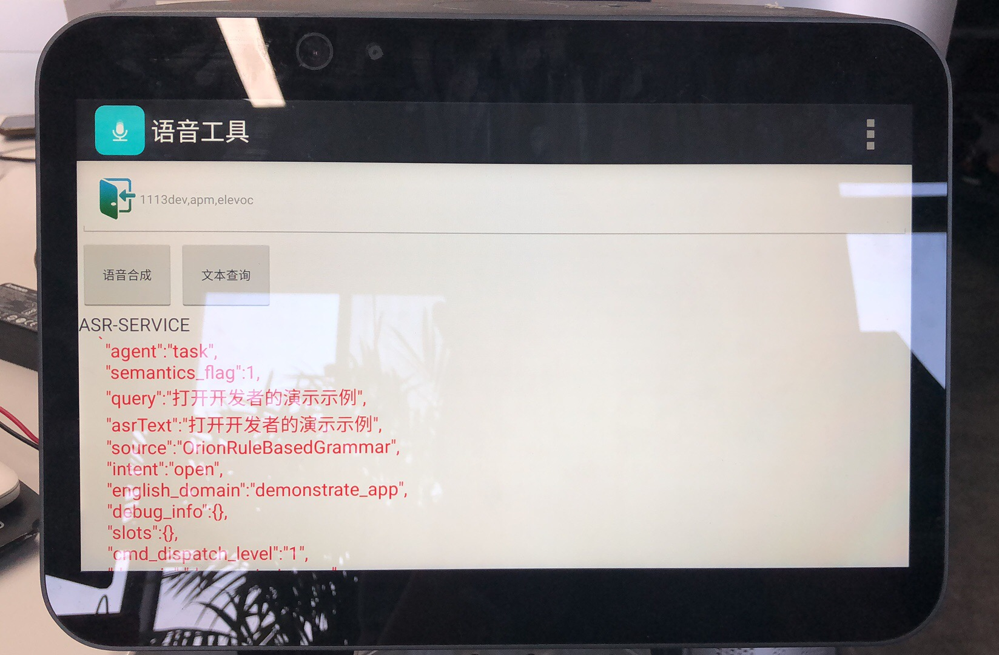

## How to test the voice link

After the voice is configured on the NLP platform, the voice tool on the robot can be used to test whether the configured voice meets the requirements.

You can open the voice tool here:

Three-finger pull-down -> Application Center -> Voice Tools.

For example: when we configure the new OPK and start the domain and intent, we want to verify whether the voice can trigger the domain and intent correctly. We only need to open the voice tool and say the corresponding words to the robot to see the key logs. For example, we I want to test that "open the developer's demo" to the robot, and see if the robot can get the correct Domain and intent. You can get the following answer:

   <video width="270" height="480" controls>
            <source src="/assets/docs/kyma/master/faq/docs/assets/voice.mp4" type="video/mp4">
   </video>

demonstrate_app&open,It is the answer we configured, and the test is complete.
