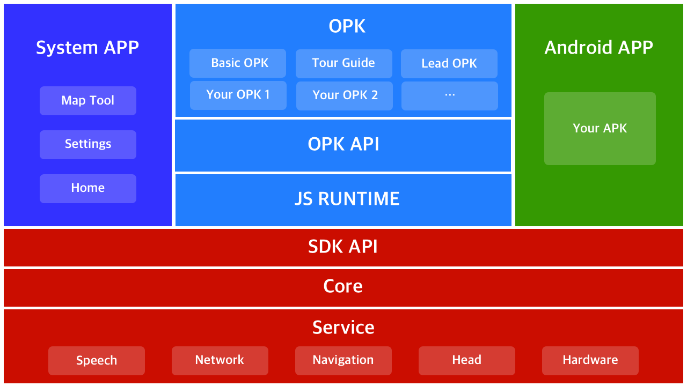

## Introduction to RobotOS
RobotOS is an open development platform developed by Orion Star based on Android.
RobotOS provides a lot of robot APIs and robot capability components, so that developers can easily develop robot applications.

## Architecture description

### Core and Service core layer

Interact with the robot AI algorithm to obtain and schedule the robot's listening, speaking, watching, and walking capabilities, and provide network access and hardware control capabilities.

### System App

Provide the most basic system service capabilities of the robot, such as emergency stop, low-power recharge, etc. When the robot is switched to the system service, the system service will take over the control of the robot. During the takeover, the upper-level business no longer has the ability to use the Robot API.

## Robot application development
Since RobotOS is based on Android. If developers already have experience in building Android APPs, it will be easy to start building a robot app. 

RobotOS provides a lot of API and capability components to help developers build their own robot applications. RobotOS also provides the configuration of the scheduling mechanism. Your application can be called up by a specified voice commands. Configure the interrupt priority of different software, etc. 

For details, please refer to the documentation and sample code.

[How to build a robot APP?]()

[How to make your app understand voice commands?]()

## Hardware access
If you are also a robot manufacturer and want to access the RobotOS open platform, the RobotOS platform also provides a friendly hardware access interface to help robot developers quickly integrate.

For more information, please contact us.

