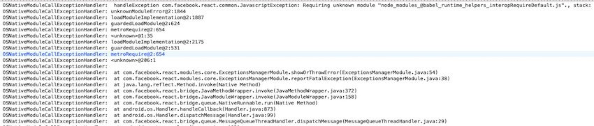
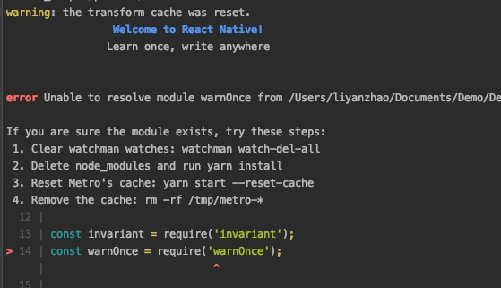
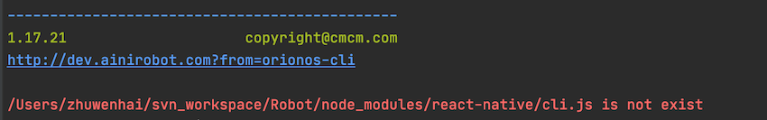

# Configuration issues

## Problems caused by too high version of Node.js

The Node.js version that the robot application (OPK) depends on cannot be higher than V13, otherwise various inexplicable problems may occur. If you encounter some unconventional problems during development or compilation, you can check the Node.js version first.

## Crash caused by babel library upgrade

Crash information:



Problem causes:

The third-party library referenced in package.json uses the `^` symbol, which will automatically match the lastest version. After the @babel library is upgraded, the old and new versions are incompatible, causing continuous crashes.

Solution:

Check the `package.json` file and remove the `^` in the `@babel/runtime` version number.

***Note: Try to avoid using the `^` symbol for dependencies in package.json, and clearly rely on the version of the library to avoid incompatibility in automatic upgrades.***

## Import a high version of React Native causes compilation failure

Exception information:



Problem causes:

The high version of react-native is introduced in the package.json dependency.

Solution:

Remove the react-native dependency in `package.json`. React-native has been integrated by default. You don't need to manually add dependencies. After removal, you need to delete the `node_modules` folder.

## react-native/cli.js is not exist

Exception information:



Problem causes:

- Caused by too high node version
- The name in package.json contains Non-English characters

Solution:

Reduce node version
The name in package.json is in English.


# Development problem

## Which component should be used for face recognition?

If you only need to identify a specific person based on conditions, you can use `WakeupAndPreWakeupStartCheckParam` and `PersonAppearComponent` components for identification. For details, please refer to the document function component-face recognition section. If you need the information of all people who can be identified currently, you can use `PersonManager Get the .getAllPerson()` interface. 

*For details, please refer to the basic interface of the document - face recognition section.*

## Does opk now support packaging and playing audio resources?

Yes. 

All file resources can be placed in the `extraResource` directory. After installation, these resources will also be copied to the robot. The file resource directory can be obtained through `AppManager.getOpkExtraPath`.

## What is the problem that the webview component is invalid after the introduction, the page is blank?

The reason is that the root component of the return content can only be the `WebView` tag. When wrapping a `View` tag in the outer layer, the page is blank and the imported page cannot be displayed. 

Documentation: https://stackoverflow.com/questions/38963046/can-i-use-webview-inside-a-view-react-native

## How to implement data communication with your own server?
You can use the fetch API to make network requests.

## How to read the parameters carried by the jump page?
You can use `props.navigation.state.params.result` to get parameters in the `constructor` function.


# Third-party library problem

## What type of third-party RN components can be used directly?

All RN components introduced in '[React Native Components]()' can be used directly. 

RN components that are not included can also be used directly if they are libraries that **only contain JS code**. Libraries that need to modify the Android code can be imported using dynamic extension components. For details, please refer to the [dynamic extension components]() section of the document.

## react-background-job does not take effect

Problem appearance:

Using `react-background-job` to start a background task does not take effect.

Problem causes:

`react-background-job` defaults to take effect only when the current application is in the background.

solution:

Set `exact` and `allowExecutionInForeground` to `true`, when starting the task.

```java
BackgroundJob.schedule({
     /**Other configuration*/
     exact: true,
     allowExecutionInForeground: true
});
```