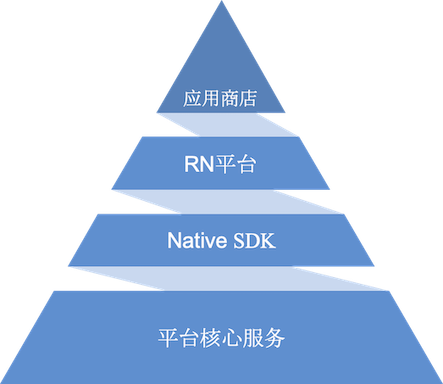

Hello Robot! Welcome to the journey of robot development. Orion Star Robot provides multiple development methods. The current document introduces how to use JavaScript language to develop a robot application. 

If you want to use Java language for development, please move to [APK development document](https://ainirobot.gatsbyjs.io/docs/apk/apk-development).

If you don’t know which development method is best for you, please [check this page](https://ainirobot.gatsbyjs.io/docs/root/get-started/#build-robot-app-build-robot-app).


## Introduction to the platform


### Platform core service

Robot core service, responsible for docking and processing various hardware on different types of robots, providing robot application developers with a simple and consistent mechanism to control complex and very different hardware devices, and providing a complete set of safety protection mechanisms to prevent robots Application developers overuse hardware to protect the safety of robots. It contains robot system-level functions such as OTA, low-battery automatic recharging, self-checking, and relocation, which simplifies application developers' development difficulties.

### Native SDK

Relying on the core services of the robot platform, it provides a unified robot access control interface and opens up all capabilities. Application developers can customize their business in depth by integrating the SDK.

### RN platform

The RN platform is an extension and transformation of the Native SDK. Based on React-Native, it introduces a more fine-grained OPK development mechanism and uses the JavsScript language for development. Make full use of RN features, introduce a plug-in mechanism, support dynamic installation and uninstallation of functions, and flexibly combine robot functions according to scenarios. Application developers can customize a single function and quickly iteratively upgrade, which greatly reduces the development difficulty.

### App Store

The app store is a complementary supplement to the robot platform. App developers put the developed OPK on the app store, and can install or uninstall OPK remotely through the app store. The app store supports automatic updates of OPK, and app developers no longer need to pay attention to the version update release , Supports dynamic modification of OPK configuration, and settings can be changed at any time to maintain the optimal operating state of the robot.

## Pre-knowledge
The RN platform is based on the extension of React Native and supports all the features of React Native. It is developed in JavaScript language. To develop robot applications, you need to have a certain understanding of React Native and JavaScript. If you have not contacted React Native and JavaScript before, you can browse it first. 

Official documentation of React Native and JavaScript:

React Native documentation: https://reactnative.dev/docs/getting-started

JavaScript documentation: https://developer.mozilla.org/en-US/docs/Web/JavaScript

The RN platform extends the access control support for robots. The "orionos-eve-core" development library needs to be introduced in package.json during development. It contains all the interfaces and functional components that the robot opens to the outside world. The robot application will eventually be compiled into one The OPK file can be installed on the robot through our scaffolding tool or application store. The robot applications appearing in the follow-up documents all refer to OPK.

## API
The basic interface is some more fine-grained Api calls, which can be called in the code at any time through RobotApi.getMapName(). It supports specifying callbacks in the parameters to receive the Api call results.

```java
let listener = new CommandListener();
listener.addListener(CommandListener.EVENT_RESULT,
    (result: number, message: string) => {
        //TODO: command execution result
        //Delete listener
        listener.removeListener();
    });
RobotApi.getMapName(listener.getId());
```

## Components
A component is a set of API calls, including certain functional strategies and status processing. There will be status reports and results returned during runtime. Developers can process them according to business requirements and quickly achieve requirements. The use of components is the same as that of RN's Component, which can be introduced by directly using the <></> tag in the render function, and the component will start or stop as the interface is displayed and hidden.

```java
public onFinish = (result?: ComponentEvent): boolean => {
    //TODO: result processing
    return true;
};
public render() {
    let personAppearParam = new PersonAppearParam();
    return (
        <>
            <PersonAppearComponent
                param={personAppearParam}
                onFinish={this.onFinish}
            />
        </>
    );
}
```
 

**Components are divided into three categories in the document:**

- Functional components: 
    
    robot functions related, including face recognition, robot motion control, etc.

- UI components: 
    
    UI-related components, including the display of the robot expansion screen and some picture effects.

- Third-party components: 
    
    mainly the current integrated third-party open source library and the way of dynamically expanding the third-party library
    

## Interface and component compatibility
There are different types of Orion Star Robots. Each type of robot does not the same, and the supported interfaces and components are also different. After each interface and component, there will be a table to explain the currently applicable robot model. 

In addition, for the same type of machine, the interfaces and components supported by different system versions will also be different. The interface and component descriptions include a minimum version description, which is the "orionos-eve-core" development library Each "orionos-eve-core" version will have a compatible robot system version.

