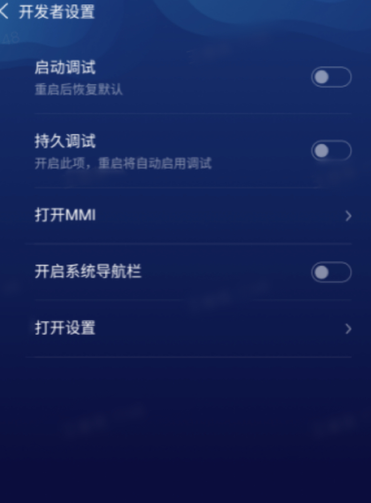

## background
In order to ensure the safety of the machine system, USB debugging (plug in adb) is disabled by default in future versions. The machine and corresponding versions are as follows:
* Greetbot: V6.9 and later versions
* Mini: V6.13 and later versions

## Open method
ADB is closed by default in the factory version, and can only be temporarily turned on by the following methods:

1. At any time (including self-check abnormality), one-finger pull down >> click the time zone multiple times in a row.

<video width="270" height="480" controls>
      <source src="/assets/docs/kyma/master/apk-development/docs/assets/one-finger-pull-down.mp4" type="video/mp4"> 
   </video>

2. The dynamic password input page pops up, which displays the system date and time，and enter your dynamic password. Obtain the dynamic password, view the 'Query dynamic password' section.

3. When "Enable debugging" is turned on, the second menu "Persistent debugging" is displayed.
    * The "Persistent debugging" menu is not displayed by default, and will only be displayed after "Enable debugging" is turned on.
    * After "Persistent debugging" is displayed, it is not turned on by default and needs to be turned on manually.
    * When the "Enable debugging" switch is turned off again, the "Persistent debugging" is automatically set to disabled and the menu is hidden.
    

For the convenience of developers, three additional shortcut functions are provided: "Open MIMI", "Open the system navigation bar", and "Open settings".

## Query dynamic password
Method 1: Provide the SN number and contact your pre-sales technical support  
Method 2: For secondary development agents, visit [the robot dynamic password query](https://wp.orionstar.com/public/dynpass/)

## Notice
1. Does not affect remote adb capabilities
2. After the machine restarts, adb continues to be closed (unless "persistent debugging" is turned on)

