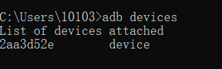
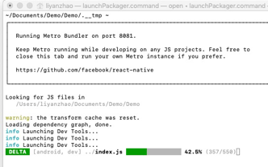
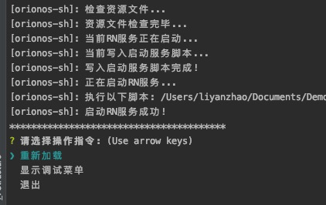
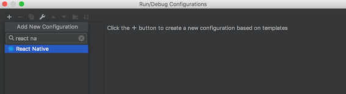
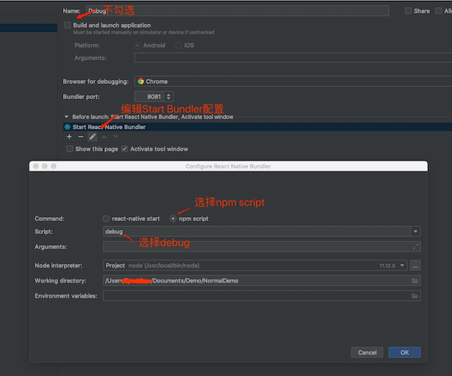
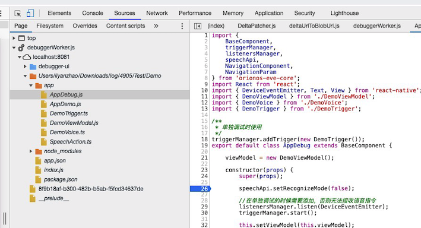

## Check before run
The installation of opk is done through the adb command. 

Before installing and debugging, please make sure that the adb command is available and the robot has opened the debugging mode. 

You can use the adb devices command to check whether the robot is successfully connected and enter the development mode. 

If everything is normal, it will return to the robot device that can be debugged. 

If you do not get the correct result at this step, you can search for ADB related issues on Google according to the error message. This step is consistent with the requirements of Android development for adb.



After checking that there are devices, we can run adb logcat and try to view the robot log. If the log can be scrolled on a full screen normally, the robot is ready for development.

## Install and run
Install opk to run the application directly on the robot. If the application has been installed before, it will be overwritten. 

After the installation is complete, the USB connection can be disconnected for test operation. The following is the installation and operation instructions:

```shell
orionos-sh run
```

After the installation is complete, it is still on the robot's big emoji UI by default, and the current application can be started through the voice command registered in the application. 

The registration of voice commands in opk is completed in the intent of index.js. For details, please refer to Application Registration in [Application Basic Knowledge](). 

If you want to start your newly developed application directly after installation and running, you can set the OPK to start by default through the following command:

```
orionos-sh set -d {appId}
```

*Note: This command is only for testing, and it will become invalid after the machine is restarted. After the application is released, it can be configured through the App Store.*

## Debugging
The principle of debugging robot application is to borrow the robot's operating environment to run the local code on the computer, so the USB must be connected all the time during debugging. 

Debug can realize the rapid release of code and support breakpoint debugging, and will not cover the installation of the application. After debugging, the installed version is still running. 

The Debug command is:
```
orionos-sh debug
```

After the debugging command is executed, a terminal pop-up window will appear. As shown in the figure below, the pop-up box is RN service. Please do not close it. 


The loading progress will be displayed on the pop-up window. During the loading process, the robot screen will display a black screen. The loading time will be longer, please be patient and wait for the loading to complete, the follow-up will be much faster. 

The following figure shows the operation interface after the debug command is executed. We can use the keyboard up and down keys to control the selection: 
- `reload`: immediately publish the newly modified code to the robot. 
- `display the debug menu`: display the debug window on the robot screen. You can turn on breakpoint debugging in the debugging popup.
- `exit`: end this debugging.




The default value of debugging can quickly update the code, and it does not support breakpoint debugging. If you are performing breakpoint debugging, please select `display the debug menu`. Click the "Debug JS Remotely" option in the debugging pop-up window on the robot, and then you use breakpoint debugging. 

Currently we support WebStorm and Chrome two ways to debug JS code.

*Note: If multiple versions of node are installed in the machine, there may be an error 'orionos-cli cannot be found'. At this time, execute the following `npm install -g orionos-cli --registry=https://npm.ainirobot.com /repository/eve-group/` to solve it.*

### Debug based on WebStorm
1. Add scripts configuration in package.json

    Based on WebStorm debugging, there is no need to execute the orionos-sh debug command separately, and the current configuration can be automatically executed when debugging starts.

    ```
    "scripts": {
        /**Other configuration*/
        "debug": "orionos-sh debug"
    }
    ```

2. Add Configuration

    We need to create a React Native debugging configuration. In the Run/Debug menu of WebStorm, select `Add configutations` or `Edit configrations`, click the `+ `button, and select `Rect Native`, as shown in the following figure:

    

3. Configure Configuration

    

    As shown in the figure above, we do not need to install the apk, so do not check `Build and launch application`. Click the edit button of `Start React Native Bundler` at the bottom, then select `npm script`, select `debug` in `Script`, `debug` is the name we configured in the first step.

4. Start debugging

    After the configuration is complete, we can click the `Debug` button to start debugging. Breakpoint debugging is not turned on by default. For the specific opening method, please refer to the debugging documentation above.


### Debug based on Chrome
Enabling Chrome debugging is relatively simple. After executing the `orionos-sh debug` command, select the debug menu, and click the `"Debug JS Remotely"` option in the debugging pop-up box of the robot interface. A new Chrome tab page will open in the Chrome menu. 

Select `More Tools -> Developer Tools`, you can view the log in the console, and perform breakpoint debugging in the sources. 

As shown in the following figure:


