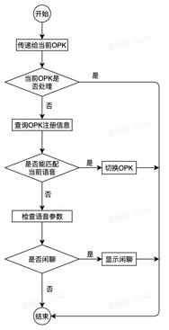

## Application directory structure
Take a new project as an example to introduce the directory structure of the App project and the role of each file type:


- `app`   //Code directory
    - `App.js `       //App's main interface
    - `AppDebug.js`   //App debugging main interface (when debugging, start OPK without parameters, and simulate data here)
    - `demo`  //Sample Code       
        - `DemoScreen`    //SampleApp UI
        - `DemoViewModel` //Functional code
        - `DemoVoice` //Voice command receiver
        - `DemoTrigger`   //Connection between Demo function and the main process (using trigger to jump between OPKs)
    - `extraResource` //File resource directory (for example: audio and video)
    - `img `      //Image resource directory
    - `dist`      //OPK storage directory (may not exist initially, it will be created automatically after OPK is packaged)
    - `node_modules`  //App dependency library (may not exist initially, execute npm install in project directory, will create automatically)
    - `.npmrc`    //npm account configuration
    - `package.json`  //App configuration and dependency library management
    - `app.json`      //App's basic configuration file (cannot be modified)


## Application components
Application components are the basic building blocks of robot applications. 

Each application component has its own exclusive responsibility. 

All application components together constitute a complete robot application.

### Voice
Voice is responsible for receiving voice commands and server-side commands, which must be inherited from `BaseVoice`.

`onListenCallback` is the voice command callback function:

```java
public onListenCallback(intent: string, result: any, id: number, text: string): boolean {
    return false;
}
```

Parameter Description:

- `intent`: voice command identification
- `result`: Voice parameters
- `text`: text content recognized by speech

Return value:

- `True`： the voice command has been processed and will not be delivered later.
- `False`: the current OPK does not process the instruction, and it will be handled by other OPKs.

### Trigger
Trigger is responsible for the connection between the current fuction and the main process. It can be used to perform the jump switch between OPKs. It needs to be inherited from Trigger. A Channel parameter is required during initialization. The parameter type is a string. It is an identifier for communicating with the ViewModel. ViewModel uses the same string.

The trigger function is used to receive the event and data carried by the ViewModel. After receiving the event, you can decide which OPK to jump to according to TriggerProtocol.eventId. The following example is to jump to the robot wakeup page after receiving the 1001 event:

```java
public trigger(protocol: TriggerProtocol): void | boolean {
    switch (protocol.eventId) {
        case 1001:
            this._trigger('home', protocol);
            break;
    }
}
```

`this._trigger('home', protocol)` is the call that actually executes the OPK jump. Its first parameter is `appKey`. Each OPK will include an `appKey` when registering information. This is the OPK's logo and the second parameter It is the parameter we want to give to the other party OPK, the receiver OPK can be obtained in the constructor using `props.navigation.state.params`.

### ViewModel
ViewModel is mainly used to implement the current business logic and needs to be inherited from BaseViewModel. It also needs a Channel parameter when it is initialized. This parameter needs to be consistent with the Trigger, otherwise the OPK jump may not be possible.

ViewModel has two life cycle functions: onStart and onStop, as the name implies, one is called when the business starts, and the other is called when the business ends.

In addition to the two life cycle functions, there are three functions used to communicate with Trigger:

- _uiTrigger(eventId, data) Jump triggered by UI event
- _voiceTrigger(eventId, data) Jump triggered by voice event
- _apiTrigger(eventId, data) Jump triggered by Api call

### Screen
Screen is the starting point of current business and user interaction. It is responsible for the UI display of the interface and the loading of functional components. It needs to be inherited from BaseComponent. Screen is the starting point of the entire business and the only point of external interaction. The display and hiding of the Screen directly determine the current The status of the business, so the life cycle of other components also needs to be bound to the Screen to maintain the same life and death as the Screen.

The relationship between interface binding and other application components needs to be called in the constructor of Screen:

```java
public constructor(props: BaseComponentProps) {
        super(props);
    this.viewModel = new DemoViewModel();
    let voice = new DemoVoice(this.viewModel);
    //Associate the life cycle of ViewModel and Voice to the current interface
    this.setViewModel(this.viewModel);
    this.setVoice(voice);
    //Registration trigger jump, must be added, otherwise the trigger is invalid
    triggerManager.addTrigger(new DemoTrigger());
}
```

Life cycle functions can be used to handle business start and stop events:

```java
//Interface display
public componentDidMount() {
    //Rewrite didMount of the interface, you must call super
    super.componentDidMount();
}
//Interface hidden
public componentWillUnmount() {
    //Rewrite the Unmount of the interface, it must be called
    super super.componentWillUnmount();
}
```

Rendering function, used to display the UI and load functional components, display a text on the interface as shown below, and start navigation when the interface is displayed:

```java
public render() {
    let navigationParam = new NavigationParam('Reception Point', 0.5, 30000, 5000, 1000, 4);
    return (
    <View>
        <Text style={{ fontSize: 17, color:'red'}}> {'Hello Robot'}</Text>
        <NavigationComponent
            param={navigationParam}
            onFinish={this.onFinish}
            onStatusUpdate={this.onStatusUpdate}
        />
    </View>
    );
}
```

## Application resources

### Picture resource
The image resource of the application needs to be placed in the img directory and loaded through require when used. The parameter is the relative path of the image, as shown in the following example:
```xml
<Image source={require('../../img/bg.png')}>
```

### File resource
File resources are uniformly placed in the extraResource directory. When the application is compiled and packaged, it will be packaged into the OPK. When the OPK is installed on the robot, the file resource storage directory can be obtained through the following interface:
```
AppManager.getOpkExtraPath();
```

## Application registration
The robot application needs to register its own information in the robot system. The information that the robot system can register is combined with external conditions (for example: voice commands) to determine whether to start the robot application. index.js is the entry file of our entire robot application. After loading It will be executed immediately, so our registration should be written in the index.js file.

```java
//Online use
AppRegistry.registerConfig([{
    appKey:'Demo',
    component: () => App,
    intent:'weather&get_weather', //for example:'weather&get_weather'
    appId: appid,
    priority: 1
}]);
//Debug use
AppRegistry.registerComponent(appName, () => AppDebug);
```

There are two registrations in the sample code, one is for the official registration to the robot system, and the other is used for debugging. These two can exist at the same time and will not affect the execution result. The system will select the corresponding registration information under different circumstances. Debugging does not involve voice scheduling and OPK switching. You only need to know the startup interface, so you only need to pass in the AppDebug debugging interface. 

Relatively more information is required for formal registration:

- `appKey`: OPK function identification (when switching OPK, the corresponding OPK will be found according to the appKey)
- `component`: OPK function start interface
- `intent`: OPK start instruction. When another OPK specifies this instruction to do Trigger jump, OPK will start. Or when the global NLP parses out this command, OPK will start. (Only fill in the command to start OPK, all commands can be received after OPK is started)
- `appId`: The appId used when creating the application
- `priority`: Function priority (OPK will compare priority when switching, low priority cannot interrupt high priority, OPK will fail to switch, priority is an array of 1-3, 1 is the highest priority, 3 is the lowest)

*Note 1: The intent can be dynamically modified through the OrionBase platform after the application is released online.*

*Note 2: Priority can be modified dynamically by contacting us after the application is released online.*

## Application jump
The application jump is carried out in the trigger. For details, please refer to the description of the application component Trigger. 

When the application jumps, you need to specify an appKey, which is specified during application registration. The scenes included in the official standard OPK and the corresponding appKey are shown in the following table Show:

<div class="fixed-table bordered-table">

|appName|appKey|Parameters|Description|
|:-----:|------|:--------:|----------|
|Portal|wakeUp|N/A|the emoji face|
|Portal|home|N/A|homepage after wakeup|
|Asking for directions|queryLocation|`{"slots":"{\"destination\":[{\"value\":\"destination point\"}]}"}` <br> *Note: The parameters in slots require an additional json_encode.*|the emoji face|
|Visitor reception|reception|N/A|the emoji face|
|Navigation|navigation|`{result:{destination: 'destination point', distance: -1}}`|navigate to destination|
|Tour Guide|guide|N/A|tour guide|
|Cruise|cruise|N/A|the emoji face|
|Advertising|advert|N/A|advertising & promotion|
|Dance|dance|N/A|robot dance|

</div>

<font color=orange>*Note 1: Please avoid duplication with the appKey in the official OPK during development.*

*Note 2: When using the lead function, the parameters in the slots require an additional json_encode.*</font>

## Voice event distribution
The voice event will be distributed to the currently running OPK first. The current OPK needs to process and consume the command. It can return true in Voice's onListenCallback. If you do not handle the interception, please return false. If the current OPK does not process the voice command, it will query the registration information of all OPKs. If the voice command belongs to the start command of a certain OPK, the priority of the OPK will be compared. If the priority of the current OPK is lower, the current OPK will be exited. Switch to the new OPK for processing. If the voice command is not capable of being processed by OPK, check whether the data carried by the voice command contains answer information, and if it contains answer information, it will be distributed to the small chat module for processing. As shown below:


