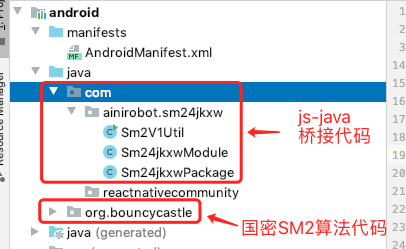
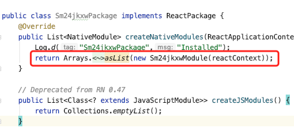
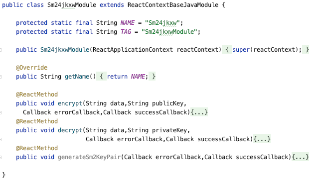
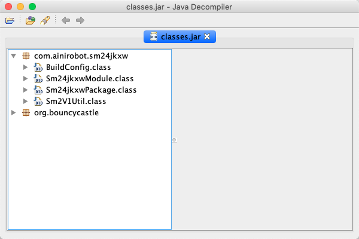

## Introduction
At present, the robot application platform supports most of the commonly used components, but if you want to access a custom native component or need to extend a third-party open source component, the robot application platform can support dynamic loading of dex files or so libraries to achieve dynamic loading and expansion Components. This method can provide opk with most of the native functions of Android, and even hardware-level functions (such as usb, Bluetooth, etc.), so that the scope of opk can be expanded.

**This method is also suitable for integrating the java code part of the react-native component written by others into the your robot for use!**


## Supported version
Different robot products support different versions of dynamic expansion components. For the specific supported versions of each product, please refer to the following table:

<div class="fixed-table bordered-table">

|Robot Model|Minimum Version|
|:---------:|:-------------:|
|GreetBot|5.12|
|Mini|5.13|
|Baodaping|4.18|

</div>

## Functional limitations

Dynamic expansion components are loaded by the robot application platform at the bottom layer, which will be intrusive. In order to protect the safety of the robot application platform, it cannot be loaded at will, and the following restrictions will be imposed:

1. You cannot load components with resources such as layout, drawable, string, etc., and none of the above resources can be obtained after loading.
2. It cannot conflict with the existing classes or so libraries of the current robot application platform, otherwise it will fail to load.
3. The React Native component bridge requires a unique name, which cannot be the same as the existing robot application platform. It is recommended to add its own business identity to the name.
4. The components that need to be embedded in AndroidManifest.xml cannot be loaded, and the embedded content will not be available.
5. It is not possible to load components that need to use Assets resources. For file resources, it is recommended to store them in the extraResource directory of the robot application.

That is, the Java code can be packaged into dex, and loaded and run in the form of reflection. Android content other than java code cannot be loaded and used.

## How to use
Here we take opk using JAVA's national secret SM2 encryption and decryption library as an example to illustrate how to implement this function:

### 1. Prepare native components or third-party open source components

Create an empty React Native project, create a new lib module in the android directory, and place our native component code or third-party open source components into lib mdoule.

In the national secret sm2 encryption library project, we directly created a new module project, the project structure is as follows:



### 2. Package NativeModule and ReactPackage

To access native modules by React Native, the native modules need to be packaged into a NativeModule and registered through ReactPackage. For specific implementation methods, please refer to the official React Native documentation. (https://reactnative.dev/docs/native-modules-android)

Declare the java module called by js in Sm24jkxwPackage.java as required.



And output the encryption and decryption interface we need in Sm24jkxwModule (at this time the national secret SM2 encryption and decryption algorithm is called)



### 3. Generate dex file
The native component module is finally integrated into the robot application in the form of a dex file. After the development is completed, the dex file can be generated by the following command:
```
gradlew dexRelease
```

The final generated dex file is stored in the `{libmodule directory}/build/intermediates/dex/release/out directory`.

In the national secret sm2 encryption algorithm project, because it is a directly established lib project, the `./gradlew` build command is executed to package the jar package. After packaging, there will be a  file named classes.jar in `build/intermediates/packaged-classes/release/`. If you use `JD-gui` to view this jar package, you will find that it packs all the code we need.



If a three-party jar package is introduced into the native module, the imported jar package also needs to be packaged into a dex file. Take fastjson as an example:

```
dx --dex --output=fastjson.dex ./fastjson-1.2.61.jar
```

dx is a tool provided in the official Android SDK. For specific usage, please refer to the official Android documentation.

    Here we directly delete the source code of the SM2 algorithm and write it into the project code, so there is no need to package the jar of the SM2 algorithm into dex. But we need to package the classes.jar just now as dex.

### 4. Integrate into the robot application

Create a new libs directory under the extraResource directory of the robot application, and create a new native component directory under the libs directory. Take trtc as an example:

```
extraResource
└── libs
    └── trtc
       ├── config.json
       ├── dexlib
       │ ├── trtc.dex
       │ └── liteavsdk.dex
       └── jnilib
           └── libliteavsdk.so
```

trtc is the name of our native component, which contains two directories and a configuration file:

<div class="fixed-table bordered-table">

|||
|:---------:|-------------|
|dexlib|dex file storage directory, because the native module additionally introduces liteavsdj.jar, there will be two dex files|
|jnilib|current native module depends on the so library storage directory (so library please select a 32-bit library)|
|config.json|is used to configure the ReactPackage class name|

</div>

Create a new config.json file, configure ReactPackage, the format is as follows:

```xml
{
    "packageClassNames": [
        "com.ainirobot.trtc.RNTRTCPackage"
    ]
}
```

The packageClassNames here is the complete class name of the reactpackage that needs to be loaded by reflection in the dex: com.ainirobot.sm24jkxw.Sm24jkxwPackage

### 5. Call native modules in the robot application
After integrating dex into the robot application, in the robot application, we can get the NativeModule we encapsulated through NativeModules, and then directly call the native module:

```
import {NativeModules} from'react-native';
const trtc = NativeModules.trtc;
```

The name of the national secret SM2 encryption and decryption library is Sm24jkxwModule, so this name is also used for reference. Here we can see that "4jkxw" has been added to the project, which is the label of the overall project. It is added to prevent module conflicts from causing the machine to fail to run normally after loading this dex.

The invocation of NativeModule is supported by the React Native framework. For details, please refer to the official React Native documentation.

### 6. The robot loads the native module.
In the orionos-sh debug mode, java code will not be loaded by reflection. We need to install the complete opk with the dex module into the machine through the orionos-sh run command, and then restart the Xiaobao program to load it. When starting the Leopard program, fill in the filter keyword "ReactPackageInDexUtil" in logcat to see the process of loading the dex file.

In the national secret SM encryption and decryption project, we can search for logs similar to the following, indicating that the library file has been loaded:

`2021-04-27 19:35:32.272 19306-19306/? I/ReactPackageInDexUtil: parseClassNameAndSo OpkExtraPath /sdcard/robot/rndata/{opkid}/extra/libs/`

Because `Log.d("Sm24jkxwPackage","Installed")` is added to Sm24jkxwPackage; so we can also see the log of `Sm24jkxwPackage:Installed` in logcat.

Once the dex file is loaded, orionos-sh debug can be used for normal debugging. The dex file will always be loaded by the robot and provide calling services.
