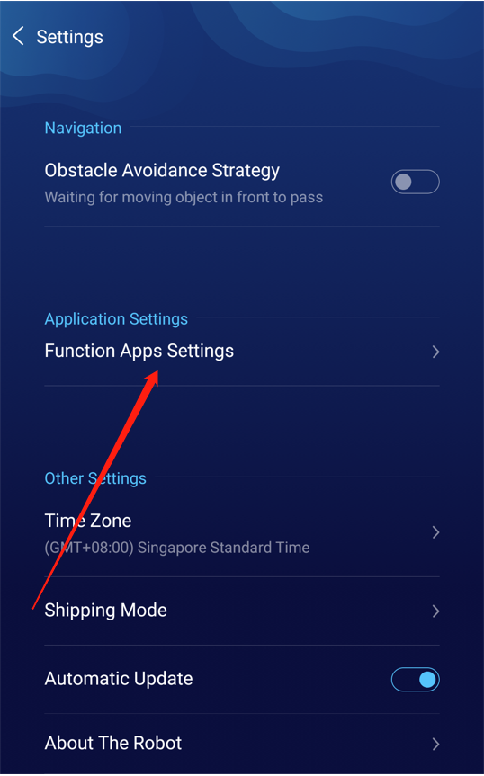
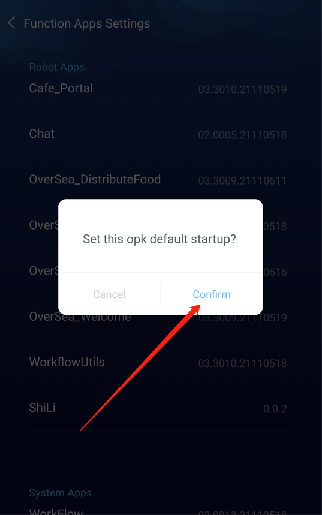
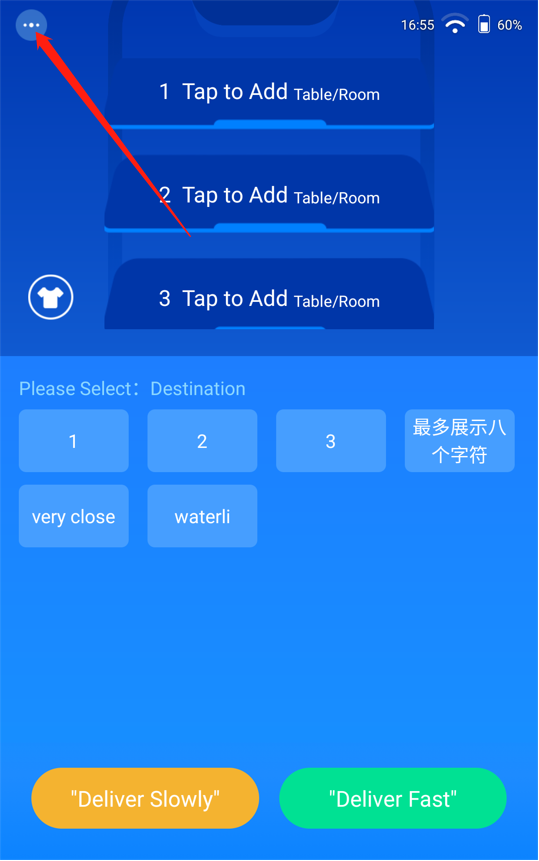
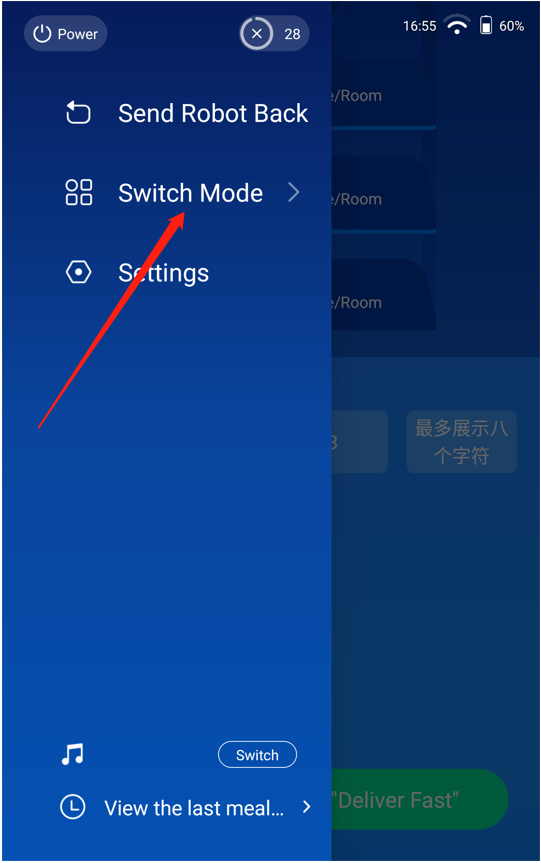
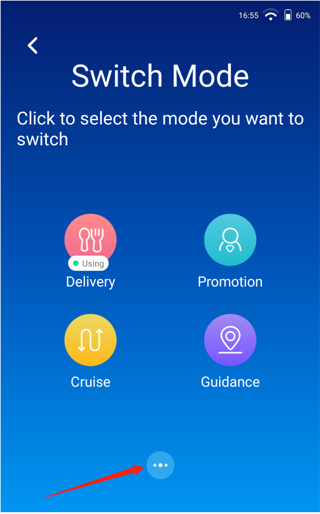
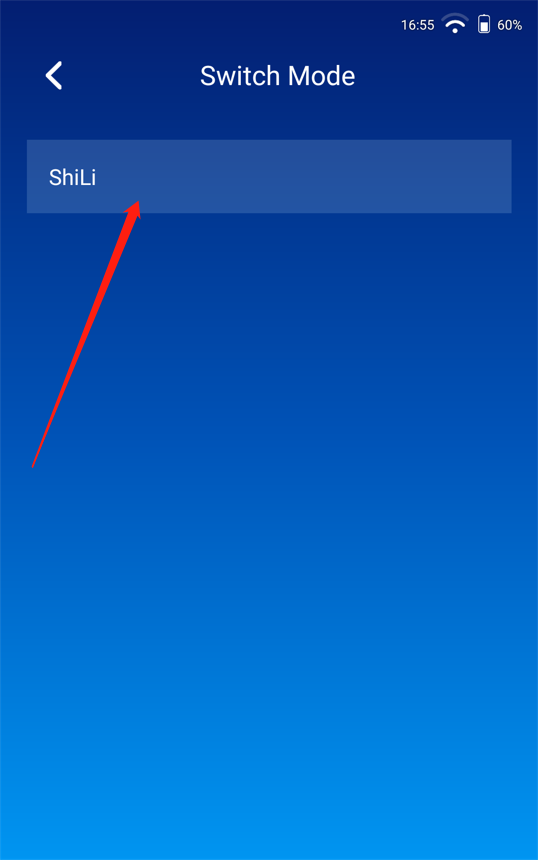

## Introduction
Lucki V6.22 is newly added, the official OPK and the three-party OPK are mixed, and the following functions are added to meet the needs of Lucki secondary development.

## Version Compatibility
Listed in the table is the minimum version of each robot model that can be compatible:

|Greetbot|Mini|Lucki|Baodaping|
|:------:|:---|:---:|:-----------:|
|NO|NO|6.22|NO|

## Start method:

1.Set OPK to start by default

Three-finger pull down -> set up -> Function Apps settings,Select the OPK you want to set as the default startup, long press and pop up the pop-up window,Click to confirm.

Three-finger pull down -> application Center -> Little Leopard,At this time, the OPK that we choose is started by default.

2.Start directly from the sidebar

You can set Basic Application as the home page,Then click on Little Leopard -> Sidebar -> Function switching -> The bottom three points -> Click on the OPK you installed,You can start directly.

Only three-party OPK applications are included in the three points.

3.Demo video

   <video width="270" height="480" controls>
      <source src="/assets/docs/kyma/master/opk-development/docs/assets/lucky_demo_video.mp4" type="video/mp4"> 
   </video>

4.Three-party opk open sidebar sample code

https://orion-base-test-1256573505.cos.ap-beijing.myqcloud.com/cn_docs_file/2021-11-08_19%3A02%3A02_ShiLi.zip

