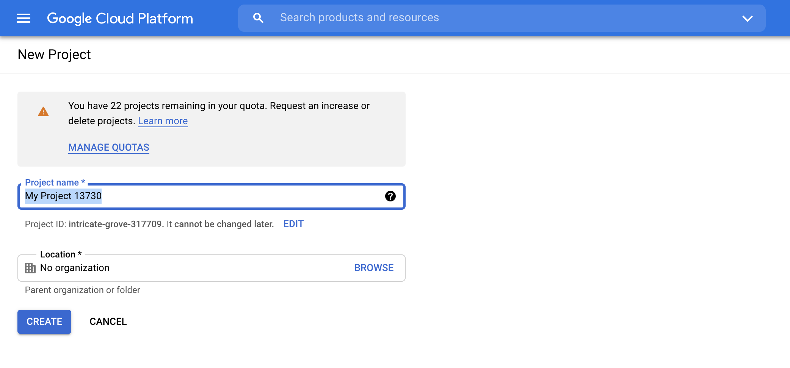
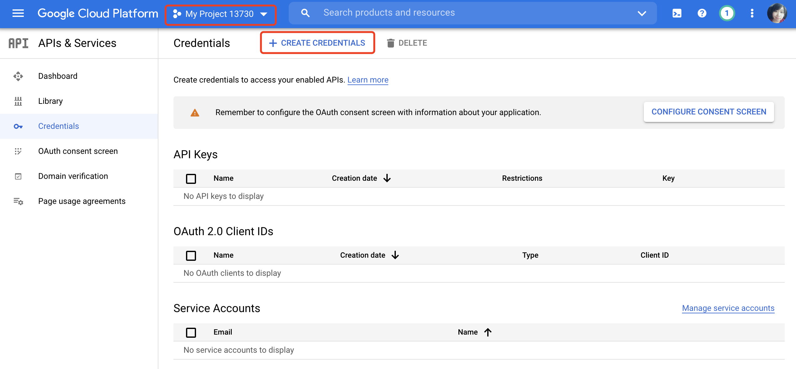
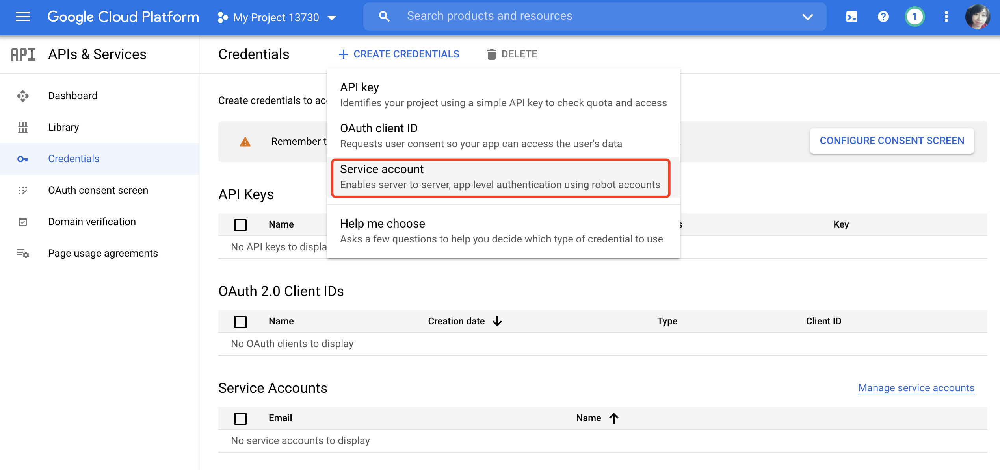
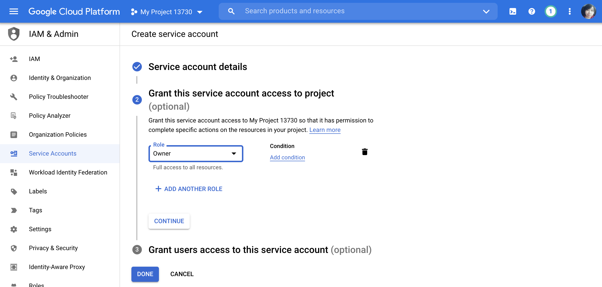
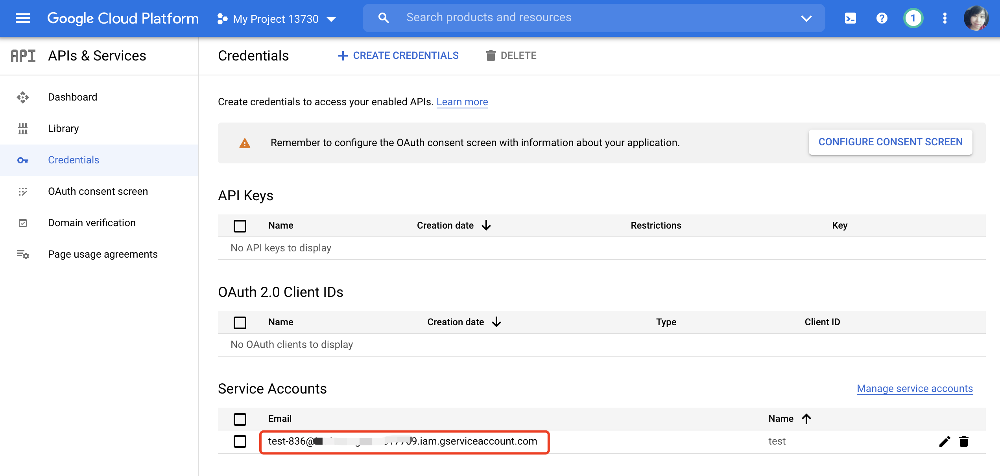
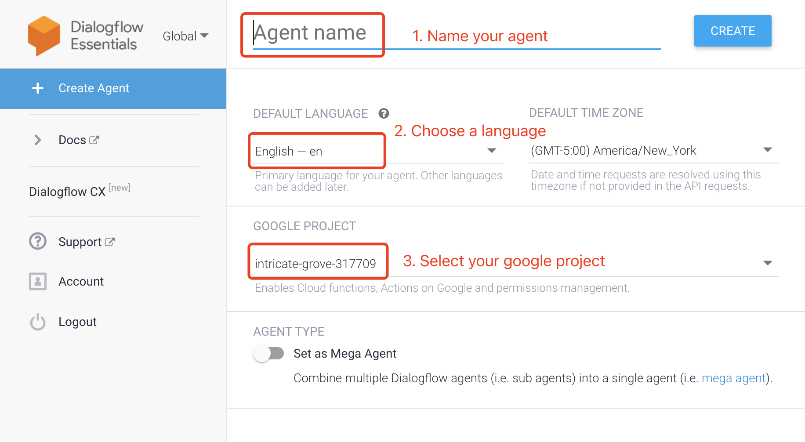
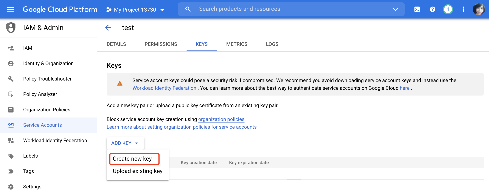
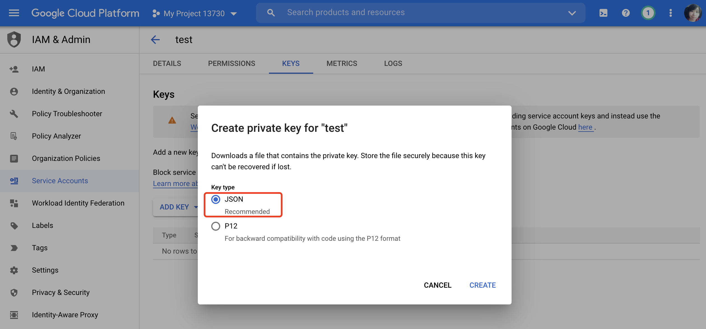
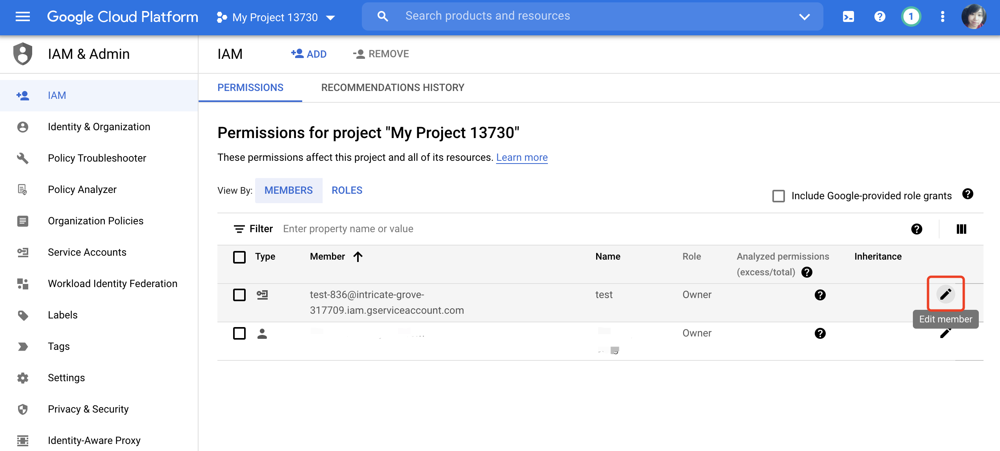
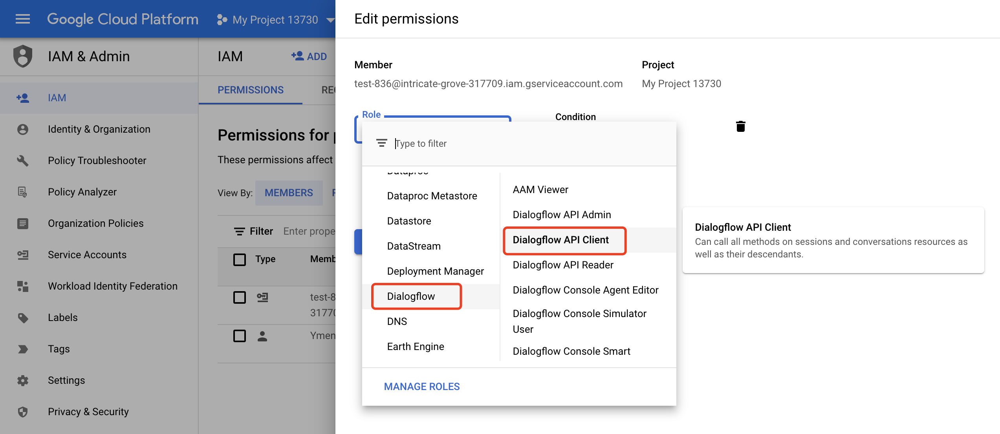

Use Google Cloud to make your robot respond to voice commands in all languages.

<div class="fixed-table bordered-table">

|Greetbot|Mini|Lucki|Baoxiaodi MAX|Baodaping|
|:-:|:-:|:-:|:-:|:-:|
|Coming Soon|Yes|No|No|No|

</div>

## Step 1: Provide account information
1. Apply for a Google gcp service account
2. Provide account information:    
    - google service credentials ( json file )
    - the id of the associated enterprise ( enterprise_id )

3. Provide the above information to our sales engineer. We will deploy it according to the information you provide.

## Step 2: How to provide Google service credentials?

### Create project

Quick link: https://console.cloud.google.com/projectcreate



### Create a service account
1. Select your project and click 'Create Credentials'

    

2. Select 'Service account'

    

3. After completing the 3-step configuration of the service account, click 'Done'.
    


4. Your service account has been generated

    

### Create Dialogflow Agent
New dialogflow agent: https://dialogflow.cloud.google.com/#/newAgent
When creating a new agent, name it, select the language, and select the google project that has been created.
Click 'Create' after the 3 steps are completed.



### Get the key
1. In 'Google Project - Credentials - Service Accounts', click your the service account (email).  Create new key.

    

2. Select key type as 'JSON', and click Create. Then save the json file.

    

 
### Edit Account Permission
Click IAM, under the tab 'Permissions', edit your service account.



Set the role 'Dialogflow API Client' to your service account, then click 'SAVE' to complete.




When you finish the steps above, please provide your google service credentials (json file) to our sales engineer.
 
## Step3: dialogflow configuration recommendations
The intent configuration can define related rules with the machine side to ensure that it can take effect on the side.
- Develop new functions: domains and intents that are not available in the ob background; intents in the dialogflow background can be output in the format desired by their apk;

    >Tips:
    It is recommended to configure in the dialog background according to the intent rules provided by us. We will split doamin and intent and then issue them.


- To trigger the existing functions of the machine, confirm that the domain and intent of the function are available in the ob background; and the dialog background needs to be configured in the format of xx::yy.
- Learn more about Dialogflow: https://cloud.google.com/dialogflow/es/docs/intents-overview

## Step 4: FAQ
1. You may get this error:

    ```
    rpc error: code = PermissionDenied desc = IAM permission'dialogflow.sessions.detectIntent' on'projects/orion-314912/agent' denied.
    ```

    This is an account authorization problem, please confirm whether you grant 'dialogflow api client' permission to the service account.

2. The dialog background configuration content is not sent normally, return to other, other. Confirm whether the responses are set in the dialogflow.